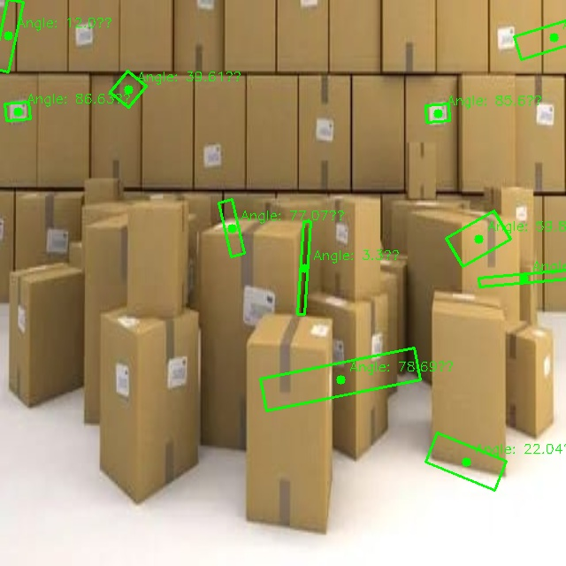

# Tech-A-Thon Project: Tech4Stack

Welcome to the *Tech4Stack* project! This repository contains all the code, data, and resources needed to deploy and understand the solutions presented at the hackathon.

---

## Table of Contents
- [Project Overview](#project-overview)
- [Features](#features)
- [Folder Structure](#folder-structure)
- [Setup Instructions](#setup-instructions)
- [Usage](#usage)
- [Dependencies](#dependencies)
- [Contributing](#contributing)
- [Screenshots and Visuals](#screenshots-and-visuals)

---

## Project Overview
The *Tech4Stack* project aims to solve challenges in object detection, pathfinding, and warehouse management through:
- *Box Detection*: Identifying and analyzing object properties.
- *Pathfinding Algorithms*: Implementing efficient algorithms to navigate mazes or solve spatial problems.
- *Warehouse Management System*: Providing tools for inventory management and task tracking.

---

## Features
1. *Object Detection and Analysis*
   - Detect and annotate objects in images.
   - Generate detailed reports for detections.
2. *Pathfinding Algorithms*
   - Implementations of A*, BFS, and Dijkstra’s algorithms.
   - Interactive maze-solving tools.
3. *Warehouse Management System*
   - Frontend and backend for managing inventory, tasks, and path planning.
   - Dashboard with visual metrics and summaries.
4. *Combined Deployment*
   - Integrated deployment scripts for real-world application.

---

### **Key Folder Descriptions**

- **Deployment**: Contains deployable scripts for the `Box Detection` and `Path Finder` features.
  - **Box Detection**: Includes `app.py` for backend and `frontend.py` for the user interface.
  - **Path Finder**: Includes `app.py` for pathfinding logic and `frontend.py` for visualization.

- **Task1**: Hosts scripts, input images, and output data for object detection.
  - **Scripts**: Contains the primary Python scripts (`one.py`, `four.ipynb`) for detection tasks.
  - **Images**: Holds the input images for processing (e.g., `obj1.jpg`, `obj2.jpg`).
  - **Outputs**: Stores processed results, including annotated images and a CSV report (`box_properties.csv`).

- **Path**: Focuses on pathfinding algorithms and their visualizations.
  - **Algorithms**: Includes scripts for various algorithms like A*, BFS, and Dijkstra's.
  - **Mazes**: Contains input maze images and solved outputs.
  - **Notebooks**: Contains Jupyter notebooks (e.g., `maze3.ipynb`) for interactive exploration.

- **Warehouse**: A complete system for warehouse management.
  - **Backend**: Includes server-side logic and database configuration.
  - **Frontend**: Contains components and public files for the user interface.

- **Miscellaneous Files**:
  - `requirements.txt`: Python dependencies.
  - `maze5.py`: Additional maze-related script.
  - `.gitignore`: Specifies files and folders to ignore in version control.

## Setup Instructions

### Prerequisites
1. Python 3.8+
2. Node.js and npm
3. Pipenv (for virtual environment management)

### Steps
1. Clone the repository:
   bash
   git clone https://github.com/your-repo/Tech-A-Thon_Tech4Stack.git
   cd Tech-A-Thon_Tech4Stack
   
2. Install Python dependencies:
   bash
   pip install -r requirements.txt
   
3. Setup the warehouse frontend:
   bash
   cd Warehouse/frontend
   npm install
   npm start
   
4. Run backend servers for deployment:
   bash
   python Deployment/Box\ Detection/app.py
   python Deployment/Path\ Finder/app.py
   

---

## Usage

### Object Detection
1. Place images in the Task1/ folder.
2. Run detection scripts (e.g., one.py).
3. Check annotated images and reports in Task1/output/.

### Pathfinding
1. Use maze images in the Path/ folder.
2. Execute pathfinding scripts (e.g., astar.py).
3. View solved maze outputs.

### Warehouse Management System
1. Access the frontend via http://localhost:3000.
2. Add tasks, manage inventory, and analyze metrics.

---

## Dependencies
Key packages and tools:
- *Python*: Flask, OpenCV, numpy
- *Node.js*: React, Axios
- *Others*: Pandas, Matplotlib

---

## Contributing
Contributions are welcome! Follow these steps:
1. Fork the repository.
2. Create a new branch.
3. Commit your changes.
4. Open a pull request.

---

## Screenshots and Visuals
### Example Maze Solution
![Solved Maze]

### Annotated Object Detection

---

For any questions or issues, feel free to open an issue or contact the contributors.

---
